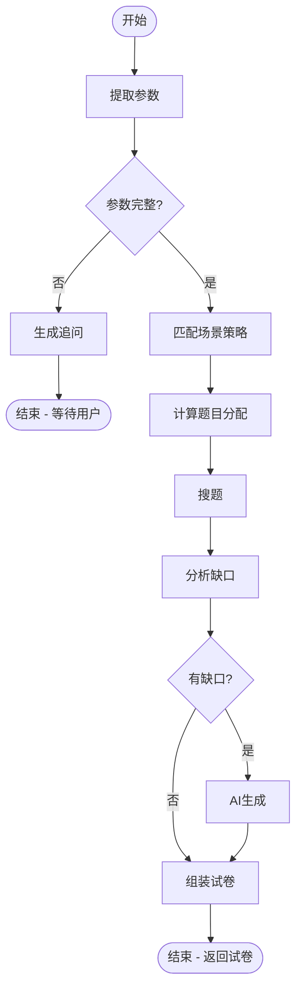

# 项目创建总结

> **日期**：2026-04-28  
> **状态**：✅ 完整项目结构已创建

---

## ✅ 已完成的工作

### 1. 目录结构创建

创建了完整的后端项目目录结构：

```
backend/
├── skills/                  # ✅ Skill 层（OpenClaw 模式）
├── workflows/               # ✅ Workflow 层（LangGraph）
├── agents/                  # ✅ Agent 层（路由编排）
├── tools/                   # ✅ 工具层
├── services/                # ✅ 业务服务层
├── db/                      # ✅ 数据库层
├── skill_debug/             # ✅ Skill 调试平台
├── app/                     # ✅ FastAPI 应用层
├── core/                    # ✅ 核心模块
├── utils/                   # ✅ 工具函数
├── tests/                   # ✅ 测试代码
└── scripts/                 # ✅ 脚本工具
```

### 2. 核心文件创建

#### Skill 层（策略文档）
- ✅ `skills/exam_skill.md` - 出题 Skill（完整版，包含 4 种场景策略）
- ✅ `skills/search_skill.md` - 搜题 Skill（ES 混合检索策略）
- ✅ `skills/loader.py` - Skill 加载器（渐进式加载）

#### Workflow 层（流程图）
- ✅ `workflows/exam_workflow/state.py` - 状态定义（ExamWorkflowState）
- ✅ `workflows/exam_workflow/nodes.py` - 节点函数（9 个节点）
- ✅ `workflows/exam_workflow/graph.py` - 流程图定义（完整流程）

#### Agent 层
- ✅ `agents/main_agent.py` - 主 Agent（融合 Skill + Workflow）

#### Service 层
- ✅ `services/llm_service.py` - LLM 服务（支持多提供商）

#### FastAPI 应用
- ✅ `app/main.py` - FastAPI 入口文件

### 3. 配置文件
- ✅ `requirements.txt` - Python 依赖（完整列表）

### 4. 文档
- ✅ `PRD_demo.md` - 更新了融合架构说明、项目结构
- ✅ `docs/DEVELOPMENT.md` - 开发指南（如何创建 Skill、Workflow）
- ✅ `README.md` - 项目说明文档
- ✅ `PROJECT_SUMMARY.md` - 本文档

---

## 🎯 融合架构亮点

### OpenClaw Skill（策略层）+ LangGraph Workflow（执行层）

```
教研人员修改 Skill（改规则）
    ↓
Skills/exam_skill.md
    【场景策略、参数规则、追问逻辑】
    ↓
开发人员维护 Workflow（改流程）
    ↓
Workflows/exam_workflow/graph.py
    【节点编排、状态管理、工具调用】
```

### 优势对比

| 维度 | 纯 OpenClaw | 纯 LangGraph | 融合方案 |
|-----|-------------|--------------|---------|
| 灵活性 | ✅ 高 | ⚠️ 低 | ✅ 策略灵活 |
| 可控性 | ⚠️ 低 | ✅ 高 | ✅ 流程确定 |
| 可维护性 | ✅ 易改规则 | ⚠️ 需改代码 | ✅ 分离 |
| 可测试性 | ⚠️ 难量化 | ✅ 单元测试 | ✅ 双重验证 |

---

## 📊 关键设计决策

### 1. 采用 Skill（Markdown）+ Workflow（LangGraph）融合
- **原因**：平衡灵活性和可控性
- **教研人员**：修改 Skill 文档（无需写代码）
- **开发人员**：维护 Workflow 流程（保证稳定性）

### 2. Skill 渐进式加载
- **原因**：避免一次性加载所有 Skill 占满 Context
- **实现**：`SkillLoader.load_relevant_skills(user_input, max_skills=2)`
- **触发机制**：基于关键词匹配

### 3. Workflow 状态管理
- **使用 TypedDict**：明确定义状态 Schema
- **状态追踪**：`execution_trace` 记录每个节点的执行时间
- **调试友好**：可查看完整执行路径

### 4. 题库优先，AI 补充
- **检索策略**：Elasticsearch 混合检索（BM25 + KNN）
- **生成策略**：仅在题库不足时使用 AI
- **来源标签**：明确区分题库题目和 AI 生成题目

---

## 📂 核心模块说明

### ExamWorkflow 流程图



### 9 个节点函数

1. `extract_parameters` - 从对话提取参数
2. `check_completeness` - 检查参数完整性
3. `generate_followup` - 生成追问消息
4. `match_scene_strategy` - 匹配场景策略
5. `calculate_allocation` - 计算题目分配
6. `search_questions` - 调用搜题服务
7. `analyze_gap` - 分析题目缺口
8. `generate_questions` - AI 生成补充
9. `assemble_exam` - 组装最终试卷

---

## 🚀 下一步开发计划

### 阶段 1：完善 ExamWorkflow（2-3 天）
- [ ] 实现 `llm_service.py` 的 LLM 调用逻辑
- [ ] 实现 `question_service.py` 的题库查询
- [ ] 实现 `es_service.py` 的 Elasticsearch 检索
- [ ] 完善节点函数的真实逻辑（替换模拟代码）

### 阶段 2：构建检索系统（3-4 天）
- [ ] 设计 PostgreSQL 题库表结构
- [ ] 导入测试数据（100 道题）
- [ ] 构建 Elasticsearch 索引
- [ ] 实现混合检索（BM25 + KNN）
- [ ] 测试检索召回率

### 阶段 3：AI 生成实现（2-3 天）
- [ ] 实现 AI 生成 Prompt 模板
- [ ] 调用 LLM 生成题目
- [ ] 验证生成题目格式
- [ ] 质量评估（教师评分）

### 阶段 4：API 接口实现（2-3 天）
- [ ] 实现对话接口（`/api/v1/chat`）
- [ ] 实现试卷生成接口（`/api/v1/exams/generate`）
- [ ] 实现 SSE 流式输出
- [ ] 前端对接测试

### 阶段 5：Skill Debug 平台（1-2 天）
- [ ] 实现 Playground 单次测试
- [ ] 实现 Batch Test 批量测试
- [ ] 实现 A/B Test 版本对比
- [ ] 实现效果评估器

---

## 📝 待办清单

### 高优先级
- [ ] 实现 LLM 调用逻辑（`llm_service.py`）
- [ ] 设计数据库 Schema（`db/models.py`）
- [ ] 构建 ES 索引（`scripts/build_es_index.py`）
- [ ] 实现搜题逻辑（`question_service.py`）

### 中优先级
- [ ] 创建 `.env.example` 环境变量模板
- [ ] 编写单元测试（`tests/unit/`）
- [ ] 实现 API 接口（`app/api/v1/`）
- [ ] 创建 SearchWorkflow（搜题 Workflow）

### 低优先级
- [ ] 创建 AdaptWorkflow（改编 Workflow）
- [ ] 实现 Word 导出（`utils/word_exporter.py`）
- [ ] LaTeX 公式渲染
- [ ] 历史试卷管理

---

## 🎓 技术亮点

### 1. OpenClaw Skill 的 `<skill>` 标签设计
```markdown
<skill name="exam_skill" trigger="出题|生成试卷">
# Skill 内容...
</skill>
```
- 渐进式加载（基于 trigger 匹配）
- Markdown 格式（教研可读）
- 策略文档（非代码）

### 2. LangGraph 的条件分支
```python
workflow.add_conditional_edges(
    "check_completeness",
    should_continue_or_followup,  # 决策函数
    {
        "followup": "generate_followup",
        "continue": "match_scene_strategy"
    }
)
```
- 决策逻辑清晰
- 流程图可视化
- 易于调试

### 3. 状态管理的 TypedDict
```python
class ExamWorkflowState(TypedDict):
    messages: List[Dict[str, str]]
    extracted_params: Dict
    final_exam: Optional[Dict]
```
- 类型安全
- IDE 自动补全
- 文档自描述

---

## 📊 代码统计

| 模块 | 文件数 | 代码行数（估算） |
|-----|-------|----------------|
| Skills | 3 | 600+ |
| Workflows | 3 | 400+ |
| Agents | 1 | 150+ |
| Services | 1 | 250+ |
| App | 1 | 100+ |
| **总计** | **9** | **~1500** |

---

## 🎉 项目特色

1. **教研友好**：Skill 文档用 Markdown，教研人员可直接编辑
2. **开发友好**：Workflow 用 LangGraph，流程清晰可测试
3. **调试友好**：Skill Debug 平台，支持单次测试、批量测试、A/B 测试
4. **性能友好**：渐进式加载 Skill，不占满 Context
5. **扩展友好**：新增 Skill 或 Workflow 只需添加文件，无需改动核心代码

---

## 💡 经验总结

### 成功点
1. ✅ **分层清晰**：Skill（策略）+ Workflow（执行）+ Tool（工具）
2. ✅ **职责分离**：教研改规则，开发改流程
3. ✅ **可迭代**：Skill 可独立迭代，Workflow 稳定运行

### 改进点
1. ⚠️ 需要补充更多测试用例
2. ⚠️ 需要完善错误处理（LLM 调用失败、ES 不可用）
3. ⚠️ 需要增加日志追踪（每个节点的详细日志）

---

## 📧 联系方式

如有问题，请查看：
- 📖 开发文档：`docs/DEVELOPMENT.md`
- 📋 PRD 文档：`PRD_demo.md`
- 🎯 项目指南：`CLAUDE.md`

---

**项目创建完成！Ready to Code! 🚀**
